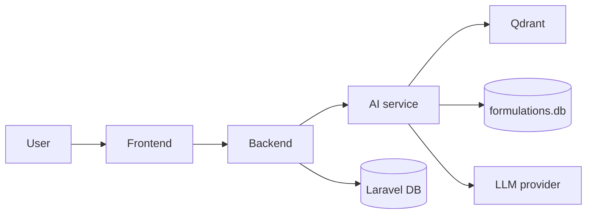

# Pharma AI — Requirements

Cosmetic and pharmaceutical formulation assistant grounded in source books (PDF/DOC in `docs/`). Answers must cite evidence from ingested documents; structured formulas are extracted and searchable separately from semantic RAG.

**Status legend:** ✅ Implemented · 🟡 Partial · 🔲 Planned (later milestone)

---

## 1. System context

| Component | Role | Default port |
|-----------|------|--------------|
| **Frontend** (Next.js) | Chat UI, evidence panel, structured formula table, thread sidebar | 3000 |
| **Backend** (Laravel) | API gateway, chat/thread persistence, health | 8000 |
| **AI service** (FastAPI) | Ingestion, retrieval, routing, LLM, formulations API | 9000 |
| **Qdrant** (Docker) | Vector store for text chunks | 6333 |

---

## 2. Functional requirements

### 2.1 Document ingestion & knowledge base

| ID | Requirement | Status |
|----|-------------|--------|
| FR-ING-01 | Ingest PDF and DOC files from a configurable `docs/` directory | ✅ |
| FR-ING-02 | Extract text per page via PyMuPDF | ✅ |
| FR-ING-03 | Skip unchanged documents on re-ingest using per-file SHA-256 manifest (`data/ingested.json`) | ✅ |
| FR-ING-04 | Support forced full re-ingest (`--force`) after schema or segmentation changes | ✅ |
| FR-ING-05 | Chunk text with configurable size/overlap (~800 tokens / ~100 token overlap) | ✅ |
| FR-ING-06 | Embed chunks with BGE (`BAAI/bge-small-en-v1.5`, 384-d) and upsert into Qdrant with deterministic IDs | ✅ |
| FR-ING-07 | Attach chunk metadata: `doc_id`, page numbers, `product_types`, `is_formula`, section titles | ✅ |
| FR-ING-08 | Detect formula regions and extract structured formulations in the same pass as chunking | ✅ |
| FR-ING-09 | Persist structured formulations in SQLite (`data/formulations.db`) | ✅ |
| FR-ING-10 | Scheduled / cron-based re-ingest when new books are added | 🟡 (`scripts/cron_ingest.sh` + example crontab; no hosted scheduler) |
| FR-ING-11 | OCR for scanned PDFs (image-only books) | 🔲 |
| FR-ING-12 | Ingest DOCX, XLSX, and web sources | 🟡 (DOCX via unified ingest; XLSX/web 🔲) |
| FR-ING-13 | Multi-tenant document libraries per organization | 🔲 |
| FR-ING-14 | Versioning and audit trail for document updates | 🔲 |

### 2.2 Structured formulation extraction

| ID | Requirement | Status |
|----|-------------|--------|
| FR-FORM-01 | Parse common table layouts: percent tables, wt/wt%, column weights, inline weights | ✅ |
| FR-FORM-02 | Parse ingredient lists and procedure steps | ✅ |
| FR-FORM-03 | Normalize ingredient names (optional spaCy `en_core_web_sm`) | 🟡 |
| FR-FORM-04 | Assign deterministic `formulation_id` for stable references | ✅ |
| FR-FORM-05 | Store confidence score per extracted formula | ✅ |
| FR-FORM-06 | LLM-assisted extraction fallback for ambiguous layouts | ✅ (`llm_extract`) |
| FR-FORM-07 | Public API: list formulations with filters (`GET /formulations`) | ✅ |
| FR-FORM-08 | Public API: search by product type and ingredient (`POST /formulations/search`) | ✅ |
| FR-FORM-09 | Move formulations store to PostgreSQL with SQL pre-filters (banned ingredients, cost) | 🔲 |
| FR-FORM-10 | Human-in-the-loop review UI for low-confidence extractions | 🔲 |

### 2.3 Retrieval & ranking

| ID | Requirement | Status |
|----|-------------|--------|
| FR-RET-01 | Semantic search: embed query → Qdrant top-k (cosine) | ✅ |
| FR-RET-02 | Metadata filters: `product_types`, `is_formula`, formula-only mode | ✅ |
| FR-RET-03 | Cross-encoder reranking (BGE reranker) blended with vector + heuristics | ✅ |
| FR-RET-04 | Intent classification: lookup, compare, reasoning, unknown | ✅ |
| FR-RET-05 | Structured-first search with score thresholds (direct / hybrid / fallback) | ✅ |
| FR-RET-06 | Query expansion via cheap LLM when vector retrieval is weak | ✅ |
| FR-RET-07 | Transparent failure message when no grounded sources found | ✅ |
| FR-RET-08 | Debug retrieval endpoint for developers (`GET /debug/retrieve`) | ✅ |
| FR-RET-09 | Hybrid BM25 + dense retrieval | ✅ |
| FR-RET-10 | Persistent query rewriting / conversation-aware retrieval | 🟡 (history + rewrite in router; Laravel passes thread history) |
| FR-RET-11 | Multilingual retrieval (Arabic queries on English books) | ✅ |

### 2.4 Chat & reasoning

| ID | Requirement | Status |
|----|-------------|--------|
| FR-CHAT-01 | Accept chat turn: `thread_id`, `message` | ✅ |
| FR-CHAT-02 | Return assistant text grounded only in retrieved sources | ✅ |
| FR-CHAT-03 | Return `cited_evidence` with document id, pages, quotes | ✅ |
| FR-CHAT-04 | Server-side validation: quotes must appear in source chunks | ✅ |
| FR-CHAT-05 | Server-side validation: ingredient amounts must be verbatim in sources | ✅ |
| FR-CHAT-06 | Return `structured_formulation` / `structured_formulations` when applicable | ✅ |
| FR-CHAT-07 | Return `suggested_next_actions` for follow-up prompts | ✅ |
| FR-CHAT-08 | Route lookup/compare queries without LLM when structured score ≥ threshold | ✅ |
| FR-CHAT-09 | Use LLM for reasoning intent (e.g. “why CAPB instead of SLS?”) | ✅ |
| FR-CHAT-10 | Expose routing metadata: `route`, `llm_used`, `search_confidence`, `fallback_stage` | ✅ |
| FR-CHAT-11 | Swappable LLM via OpenAI-compatible API (OpenRouter default) | ✅ |
| FR-CHAT-12 | Accept `structured_brief` (product type, banned/preferred ingredients, batch size, cost target) | ✅ |
| FR-CHAT-13 | Streaming token responses (SSE) | ✅ |
| FR-CHAT-14 | User feedback on answers (thumbs up/down) for eval loops | 🔲 |
| FR-CHAT-15 | Regenerate / edit last turn | 🔲 |

### 2.5 Formulation tools (product features)

| ID | Requirement | Status |
|----|-------------|--------|
| FR-TOOL-01 | Suggested next steps rendered in UI and clickable to pre-fill composer | ✅ |
| FR-TOOL-02 | Batch size calculator from formula percentages | ✅ |
| FR-TOOL-03 | Ingredient substitution suggestions with compatibility notes | 🔲 |
| FR-TOOL-04 | Cost estimator from ingredient price list | 🔲 |
| FR-TOOL-05 | Regulatory / INCI / banned-substance checks per market | 🔲 |
| FR-TOOL-06 | Export formula to PDF/Excel | 🟡 (CSV export in chat/library) |
| FR-TOOL-07 | Compare two formulas side-by-side in UI (beyond chat text) | ✅ |

### 2.6 Frontend (Next.js)

| ID | Requirement | Status |
|----|-------------|--------|
| FR-UI-01 | Chat page with message thread and composer | ✅ |
| FR-UI-02 | Evidence panel showing citations from latest assistant turn | ✅ |
| FR-UI-03 | Structured formula panel (ingredient table + procedure) | ✅ |
| FR-UI-04 | Suggested actions panel | ✅ |
| FR-UI-05 | Chat history sidebar: list threads, open thread, create new thread | ✅ |
| FR-UI-06 | Backend connectivity indicator on chat page | ✅ |
| FR-UI-07 | Light/dark theme toggle (`AppColors` design tokens) | ✅ |
| FR-UI-08 | Responsive layout (mobile stack, desktop three-column with history) | ✅ |
| FR-UI-09 | Retry failed message send | ✅ |
| FR-UI-10 | Structured brief form (product type, constraints) before send | ✅ |
| FR-UI-11 | Arabic / English UI with translation files | ✅ |
| FR-UI-12 | RTL layout for Arabic | ✅ |
| FR-UI-13 | Corpus dashboard for ingest status and knowledge-base stats | ✅ (`/corpus`) |
| FR-UI-14 | Open source PDF at cited page from evidence panel | ✅ |

### 2.7 Backend (Laravel)

| ID | Requirement | Status |
|----|-------------|--------|
| FR-API-01 | `GET /api/health` — backend liveness | ✅ |
| FR-API-02 | `POST /api/chat/messages` — proxy to AI service, persist user + assistant messages | ✅ |
| FR-API-03 | `GET/POST /api/chat/threads` — list and create threads | ✅ |
| FR-API-04 | `GET /api/chat/threads/{id}` — thread detail with messages and citations JSON | ✅ |
| FR-API-05 | Validate `thread_id` as UUID; validate message body | ✅ |
| FR-API-06 | Transactional persist: user message saved even if AI call fails (rollback on failure) | ✅ |
| FR-API-07 | Map AI errors to 502/4xx with safe client message | ✅ |
| FR-API-08 | `PATCH` / `DELETE` chat threads (rename, delete) | ✅ |
| FR-API-09 | `GET /api/health/ready` — proxy AI corpus readiness | ✅ |
| FR-API-10 | Warehouse API proxy (`upload`, `resolve`, `discover`) | ✅ |
| FR-API-11 | User authentication (login, API tokens) | 🔲 |
| FR-API-12 | Per-user thread isolation | 🔲 |
| FR-API-13 | Rate limiting and abuse protection | 🔲 |

### 2.8 Warehouse inventory → product discovery

| ID | Requirement | Status |
|----|-------------|--------|
| FR-WH-01 | Upload manufacturer inventory CSV/XLSX | ✅ |
| FR-WH-02 | Auto-detect material name column; optional SKU/qty | ✅ |
| FR-WH-02a | Arabic inventory sheets (e.g. عمود **البيان**); skip دفعة/رصيد rows; merge duplicates | ✅ |
| FR-WH-03 | Resolve trade names: Arabic dictionary → rules → corpus fuzzy → LLM batch | ✅ |
| FR-WH-04 | Flag low-confidence aliases for review | ✅ |
| FR-WH-05 | Discover book formulas ranked by ingredient coverage % | ✅ |
| FR-WH-06 | Tiers: makeable (≥95%), partial (≥50%), with missing list | ✅ |
| FR-WH-07 | Citations per result (doc_id, PDF/book page, quote excerpt) | ✅ |
| FR-WH-08 | Export discover results as CSV | ✅ |
| FR-WH-09 | Warehouse UI at `/warehouse` with analyze + discover flow | ✅ |
| FR-WH-10 | Persist structured formulas on chat reload | ✅ |
| FR-WH-11 | Per-user / multi-upload warehouse history | 🔲 |
| FR-WH-12 | Manual alias override in UI | ✅ |

### 2.9 AI service operations

| ID | Requirement | Status |
|----|-------------|--------|
| FR-OPS-01 | `GET /health` — liveness | ✅ |
| FR-OPS-02 | `GET /health/live` — Kubernetes liveness | ✅ |
| FR-OPS-03 | `GET /health/ready` — readiness (Qdrant collection + SQLite formulations) | ✅ |
| FR-OPS-04 | Dockerfile for containerized deployment | ✅ |
| FR-OPS-05 | Retrieval evaluation scripts without LLM cost (`eval_retrieval`, `eval_precision`) | ✅ |
| FR-OPS-06 | Routing evaluation script (`eval_routing`) | ✅ |
| FR-OPS-07 | Golden datasets for retrieval and routing regression | ✅ |
| FR-OPS-08 | Production hide debug routes unless `DEBUG_RETRIEVAL=true` | ✅ |

---

## 3. Non-functional requirements

### 3.1 Performance & scalability

| ID | Requirement | Status |
|----|-------------|--------|
| NFR-PERF-01 | Ingest full corpus (~3 books) in roughly 1–2 minutes on dev hardware | ✅ (target) |
| NFR-PERF-02 | Chat turn P95 &lt; 45s including LLM (backend HTTP timeout default 45s) | 🟡 |
| NFR-PERF-03 | Lookup/compare path avoids LLM for sub-second structured responses | ✅ |
| NFR-PERF-04 | Embeddings run on CPU (no GPU required for MVP) | ✅ |
| NFR-PERF-05 | Horizontal scale of stateless AI service replicas behind load balancer | 🔲 |
| NFR-PERF-06 | Async ingest job queue for large corpora | 🔲 |
| NFR-PERF-07 | CDN + edge caching for static frontend | 🔲 |

### 3.2 Reliability & availability

| ID | Requirement | Status |
|----|-------------|--------|
| NFR-REL-01 | Graceful degradation when AI service unreachable (user-visible error, retry) | ✅ |
| NFR-REL-02 | Readiness probe fails if Qdrant empty or SQLite missing formulations | ✅ |
| NFR-REL-03 | Idempotent re-ingest without duplicate chunk UUIDs | ✅ |
| NFR-REL-04 | Automated backups of Qdrant volume and SQLite | 🔲 |
| NFR-REL-05 | 99.9% uptime SLA in production | 🔲 |

### 3.3 Security & privacy

| ID | Requirement | Status |
|----|-------------|--------|
| NFR-SEC-01 | Secrets only in `.env` / `.env.local` (never committed) | ✅ |
| NFR-SEC-02 | CORS enabled on AI service for dev (permissive `*`) | 🟡 |
| NFR-SEC-03 | Authenticated API access on backend and AI service | 🔲 |
| NFR-SEC-04 | TLS termination at reverse proxy in production | 🔲 |
| NFR-SEC-05 | PII redaction in logs | 🔲 |
| NFR-SEC-06 | Tenant data isolation for multi-customer deployment | 🔲 |
| NFR-SEC-07 | API key rotation for LLM and Qdrant | 🔲 |

### 3.4 Accuracy & trust (RAG quality)

| ID | Requirement | Status |
|----|-------------|--------|
| NFR-ACC-01 | Answers must not invent citations; invalid quotes stripped or flagged | ✅ |
| NFR-ACC-02 | `quote_verified` flag on evidence when quote matches chunk text | ✅ |
| NFR-ACC-03 | Grounding-only system prompt (no general world knowledge as authority) | ✅ |
| NFR-ACC-04 | Regression tests on golden retrieval queries (no LLM spend) | ✅ |
| NFR-ACC-05 | Optional LLM spot-check eval (paid, opt-in) | ✅ |
| NFR-ACC-06 | Target ≥90% retrieval hit@k on golden set for core product queries | 🔲 |
| NFR-ACC-07 | Human evaluation rubric for formulation safety | 🔲 |

### 3.5 Maintainability & observability

| ID | Requirement | Status |
|----|-------------|--------|
| NFR-MAINT-01 | Monorepo with separate service READMEs | ✅ |
| NFR-MAINT-02 | Config via environment variables (pydantic-settings / Laravel `.env`) | ✅ |
| NFR-MAINT-03 | Structured logging in AI service | ✅ |
| NFR-MAINT-04 | OpenAPI docs from FastAPI (`/docs`) | ✅ |
| NFR-MAINT-05 | Centralized metrics (Prometheus) and tracing (OpenTelemetry) | 🔲 |
| NFR-MAINT-06 | CI pipeline: lint, test, eval retrieval on PR | 🔲 |

### 3.6 Cost & resource efficiency

| ID | Requirement | Status |
|----|-------------|--------|
| NFR-COST-01 | Minimize LLM calls via intent routing and structured direct answers | ✅ |
| NFR-COST-02 | Local embeddings and reranker caches under `data/hf-cache` | ✅ |
| NFR-COST-03 | Configurable model/provider without code changes | ✅ |
| NFR-COST-04 | Per-tenant LLM budget caps and usage dashboards | 🔲 |

### 3.7 Compatibility & portability

| ID | Requirement | Status |
|----|-------------|--------|
| NFR-COMPAT-01 | macOS/Linux dev; Docker for Qdrant | ✅ |
| NFR-COMPAT-02 | Python 3.12+ for AI service | ✅ |
| NFR-COMPAT-03 | PHP 8.2+ / Laravel 11+ for backend | ✅ |
| NFR-COMPAT-04 | Node 20+ for frontend | ✅ |
| NFR-COMPAT-05 | Deploy to single VPS or Kubernetes | 🔲 |

### 3.8 Usability & accessibility

| ID | Requirement | Status |
|----|-------------|--------|
| NFR-UX-01 | Clear empty states for evidence and structured panels | ✅ |
| NFR-UX-02 | Keyboard-accessible chat composer and actions | 🟡 |
| NFR-UX-03 | WCAG 2.1 AA contrast using design tokens | 🟡 |
| NFR-UX-04 | Onboarding copy and example prompts for new users | 🔲 |
| NFR-UX-05 | Inline explanation of confidence and `quote_verified` | 🔲 |

---

## 4. Planned milestones (roadmap)

Rough ordering for 🔲 items above:

| Milestone | Theme | Examples |
|-----------|--------|----------|
| **M1 — Multi-user (optional)** | Production-ready access | Per-user threads, rate limits (no role tiers) |
| **M2 — Brief-driven search** | Constraint-aware answers | Wire `structured_brief` into retrieval and banned-ingredient filters |
| **M3 — Corpus scale** | More sources | OCR, DOCX, PostgreSQL formulations, ingest queue |
| **M4 — Retrieval v2** | Higher precision | BM25 hybrid, conversation context, Arabic query support |
| **M5 — Warehouse v2** | Inventory at scale | Per-user uploads, manual alias overrides, cost-aware ranking |
| **M6 — Formulator tools** | Beyond Q&A | Batch calculator, substitution, regulatory checks, exports |
| **M7 — Platform** | Operate at scale | K8s, metrics, CI eval gates, backups, full i18n/RTL UI |

---

## 5. Out of scope (explicit non-goals for now)

- Clinical trial management or medical diagnosis
- GMP batch manufacturing execution (MES)
- Real-time collaboration / Google Docs-style co-editing
- Role-based access (admin / formulator / read-only tiers)
- Training custom foundation models (fine-tuning is 🔲 future research only)

---

## 6. Acceptance criteria (MVP — current release)

The MVP is considered satisfied when:

1. A developer can ingest `docs/`, start all three services, and receive a cited answer at `/chat`.
2. Lookup-style questions (e.g. “baby shampoo formula”) return structured data and/or citations without requiring an LLM when confidence is high.
3. Reasoning questions invoke the LLM and return verifiable quotes.
4. Chat threads persist across reload via Laravel APIs.
5. `eval_retrieval.py` passes on the golden set without API spend.
6. No secrets or multi-GB runtime artifacts are committed to git.

---

## 7. Related documentation

- [README.md](README.md) — quick start and architecture summary  
- [ai-service/README.md](ai-service/README.md) — AI pipeline, env vars, eval scripts  
- [frontend/README.md](frontend/README.md) — frontend-specific notes (if present)  
- [backend/README.md](backend/README.md) — backend setup  

*Last updated to reflect the codebase as of the initial GitHub release.*
